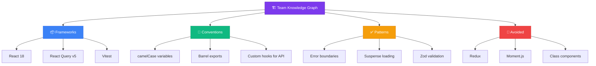
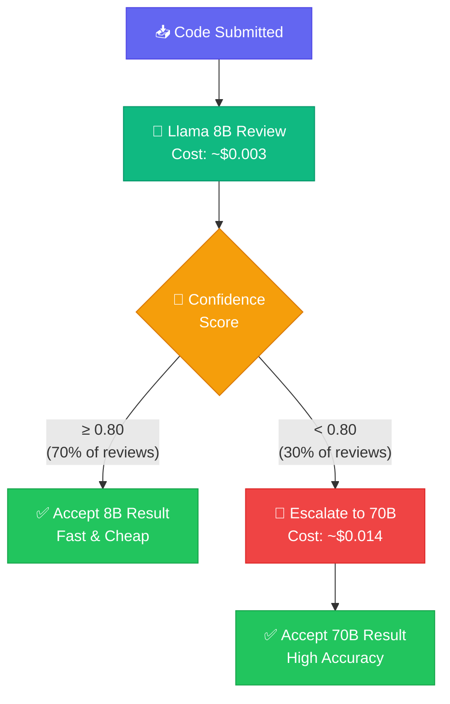
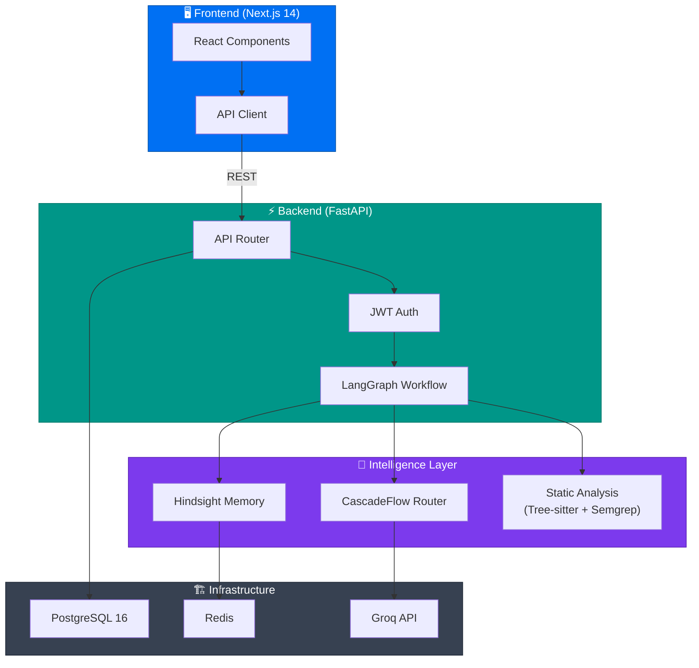

# CodePilot AI — Hackathon Presentation

> **10-Slide Pitch Deck**
> Duration: 5–7 minutes

---

## Slide 1: Title

<div align="center">

# 🚀 CodePilot AI

### AI Code Reviewer with Persistent Memory & Intelligent Cost Optimization

*"The code reviewer that learns your team — and never forgets."*

</div>

---

## Slide 2: The Problem

### Code Reviews Are Broken at Scale

| Pain Point | Impact |
|---|---|
| ❌ **Inconsistent quality** | Junior and senior reviewers give wildly different feedback |
| ❌ **AI reviews are expensive** | Every review hitting GPT-4 / large models costs $0.10–$0.50+ |
| ❌ **AI has amnesia** | Every session starts fresh — it forgets your team's conventions |
| ❌ **No feedback loop** | Developers reject suggestions, but the AI never learns from it |

> *"Imagine a senior developer who joins your team fresh every single morning — no memory of yesterday's decisions, yesterday's code, or yesterday's reviews."*

**That's the state of AI code review today.**

---

## Slide 3: Our Solution

### CodePilot AI: An AI Reviewer That **LEARNS** and **SAVES**

```
┌──────────────────────────────────────────────────────┐
│                                                      │
│   Review → Feedback → Memory → Better Reviews        │
│                         ↑                    ↓       │
│                         └────────────────────┘       │
│                      CONTINUOUS LEARNING LOOP         │
│                                                      │
└──────────────────────────────────────────────────────┘
```

**Two core technologies:**

| Technology | Role |
|---|---|
| 🧠 **Hindsight** | Persistent memory — remembers team preferences forever |
| ⚡ **CascadeFlow** | Smart routing — uses cheap models when possible, expensive ones only when necessary |

**Result:** Reviews that get **smarter over time** while costs go **down**.

---

## Slide 4: Team Knowledge Graph (Hindsight)

### Your AI Builds a Living Profile of Your Team



> **Example Recall:**
> *"I remember your team prefers React Query over Redux for state management, uses camelCase naming, and avoids class components."*

The Knowledge Graph is **automatically built** from accepted and rejected suggestions — no manual configuration required.

---

## Slide 5: Memory Evolution

### Watch the AI Get Smarter With Every Review

```
Review #1  │ ██░░░░░░░░ │ Generic suggestions
           │            │ "Consider using Redux for state management"
           │            │
Review #5  │ █████░░░░░ │ Personalized suggestions
           │            │ "Using React Query aligns with team conventions ✓"
           │            │
Review #15 │ ████████░░ │ Deep team understanding
           │            │ "This custom hook follows your team's useApi pattern ✓"
           │            │
Review #30 │ ██████████ │ Expert-level reviews
           │            │ Knows frameworks, patterns, edge cases, preferences
```

### Acceptance Rate Over Time

```
100% ┤
 90% ┤                                    ●━━━━━━━━━●
 80% ┤                          ●━━━━━━━●
 70% ┤                ●━━━━━━━●
 60% ┤      ●━━━━━━━●
 50% ┤●━━━●
     └─────┴────────┴────────┴─────────┴───────────┴──→
     R1    R5      R10      R15       R20         R30
```

> **Key Insight:** As the AI learns your team's preferences, the acceptance rate **climbs from ~50% to 90%+**, and the value of each review increases dramatically.

---

## Slide 6: Confidence-Based Escalation (CascadeFlow)

### Smart Routing = Same Quality, 78% Less Cost



**How confidence is calculated:**
- Sentiment consistency across categories
- Self-reported uncertainty markers
- Code complexity vs. model capability
- Historical accuracy for similar code patterns

---

## Slide 7: Live Demo

### See CodePilot AI in Action

```
┌─────────────────────────────────────────────────────┐
│                                                     │
│   1. Upload Python code with a subtle SQL           │
│      injection vulnerability                        │
│                                                     │
│   2. See scored review: 72/100                      │
│      • Security: 45/100 ⚠️ (SQL injection found)   │
│      • Style: 90/100 ✅                             │
│      • Testing: 65/100 (missing edge cases)         │
│                                                     │
│   3. Accept the security fix suggestion              │
│      Reject the "use ORM instead" suggestion        │
│                                                     │
│   4. Watch Knowledge Graph update:                  │
│      ✅ "Team uses parameterized queries"           │
│      🚫 "Avoided: ORM for this project"            │
│                                                     │
│   5. Check CascadeFlow: This review escalated       │
│      to 70B (security content → low confidence)     │
│                                                     │
└─────────────────────────────────────────────────────┘
```

---

## Slide 8: Cost Impact

### Real Numbers, Real Savings

| Metric | Without CascadeFlow | With CascadeFlow | Savings |
|--------|--------------------:|------------------:|--------:|
| Cost per review | $0.014 | $0.005 | **64%** |
| 1,000 reviews/month | $14.00 | $5.00 | **$9.00** |
| 10,000 reviews/month | $140.00 | $50.00 | **$90.00** |
| Annual (10K/mo) | $1,680 | $600 | **$1,080** |

```
Cost Per Review Over Time
─────────────────────────────────────
$0.014 ┤●
       ┤ ╲
$0.010 ┤  ╲
       ┤   ╲___
$0.006 ┤       ╲___
       ┤            ╲_______
$0.003 ┤                     ●━━━━━━━━━━
       └──┬────┬────┬────┬────┬────┬──→
        Month1  2    3    4    5    6

As memory grows → fewer escalations → lower average cost
```

> **Key Insight:** CascadeFlow costs go **down over time** because Hindsight memory makes the small model increasingly confident on team-specific patterns.

---

## Slide 9: Architecture

### Production-Ready, Modular, Extensible



### LangGraph Workflow (8 Nodes)

```
Parse → Static Analysis → Recall Memory → Load Knowledge
    → Initial Review (8B) → Confidence Check
        → [HIGH] Merge Results → Score & Report
        → [LOW]  Escalate (70B) → Merge Results → Score & Report
```

---

## Slide 10: Future Vision

### CodePilot AI — The Road Ahead

```
┌──────────────────────────────────────────────────────┐
│                                                      │
│   🔐  GitHub PR Integration                         │
│       Review code directly in pull requests          │
│       with inline comments                           │
│                                                      │
│   👥  Team Collaboration                             │
│       Shared Knowledge Graphs across teams           │
│       Role-based access and team analytics           │
│                                                      │
│   📏  Custom Rules Engine                            │
│       Define team-specific review rules via YAML     │
│       Enforce architectural decisions automatically  │
│                                                      │
│   🏢  Enterprise Deployment                         │
│       Kubernetes, SSO/SAML, audit logging            │
│       On-premise LLM support                         │
│                                                      │
│   🌍  16+ Language Support                           │
│       Go, Rust, Java, C++, TypeScript, and more     │
│                                                      │
└──────────────────────────────────────────────────────┘
```

<div align="center">

### *"The AI code reviewer that gets smarter every day."*

**CodePilot AI** — Built with Hindsight 🧠 and CascadeFlow ⚡

🚀 **Thank you!**

</div>
